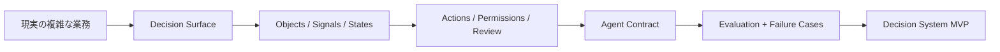

# Palantir Ontology

**Palantir風の ontology-driven AI 意思決定システムを、自分のローカル環境で構築するためのスキルです。**

[](LICENSE)


Language: [English](README.md) | [Japanese](README.ja.md) | [Chinese](README.zh-CN.md)


## これは何か

`palantir-ontology` は、現実の業務フロー、コードベース、データセット、チケット、ポリシー文書、運用ドキュメントを入力として、**Decision System Spec** を設計するための高機能スキルです。

このスキルが出力するのは、たとえば次のようなものです。

- AIシステムが本当に何を判断するのか
- 現実世界の中で何をオブジェクトとして扱うのか
- どのシグナルが重要なのか
- どのアクションが許されるのか
- どこで人間承認が必要なのか
- どうやって安全に評価するのか
- 最初のMVPで何を自動化すべきか

これは Palantir の社内資産の流出でも、内部 prompt の再現でも、公式統合でもありません。

これは、**Palantir の公開情報から読み取れる設計思想を、ローカルで使える skill として再構成したオープンな方法論**です。

## なぜ重要か

ほとんどの企業AIプロジェクトは、同じ理由で失敗します。

**判断ではなく、モデルや prompt から設計を始めてしまうからです。**

多くのチームが最初に作るのは、

- チャットボット
- 検索レイヤー
- 長い system prompt
- 可視化ダッシュボード

です。

でも、本当に必要なのは次の定義です。

- 何を判断するのか
- 何を観測できるのか
- 何に対して行動するのか
- どの行動が安全か
- どこに人間を残すべきか

この repo は、次の考え方を中心に置いています。

> 設計単位は prompt ではない。  
> 設計単位は decision である。

## この repo に入っているもの

- 再利用可能な skill 本体: [palantir-ontology](palantir-ontology)
- ontology-driven な意思決定設計の方法論
- action guardrail の設計パターン
- 業界別パック
- Decision System Spec のテンプレート
- spec をすぐ作るための補助スクリプト

単なる「ファイルを読めるAI」ではなく、**現実の運用判断を設計できるAI基盤**が欲しい人向けです。

## この skill が実際にやること

入力が次のどちらか、または両方であれば動きます。

- **goal**  
  例: `リリース前のインシデントを優先順位付けしたい`

- **context set**  
  例: コードベース + 運用ルール + チケット一覧 + CSV + スキーマ

そこから次のものを設計します。

1. 核となる業務判断
2. 運用オブジェクト
3. 重要シグナル
4. 可能なアクション
5. 権限とレビュー境界
6. ワークフロー
7. 評価計画
8. 足りないデータ
9. MVPの進め方

つまり、**生の業務の複雑さを、ローカルで動かせる AI decision system の設計へ変換する**スキルです。

## 基本の考え方



多くのチームは A から E に飛びます。  
このスキルは、その間の設計を飛ばさせません。

## アーキテクチャ

この repo は、Palantir の公開された設計思想のうち、ローカルで再現価値の高い部分を取り出しています。

### 1. World model

現実世界を次の要素で表現します。

- objects
- properties
- relations
- states
- signals

### 2. Action model

AIに何をさせてよいかを定義します。

- `auto`
- `recommend`
- `review`
- `forbidden`

### 3. Agent contract

次を定義します。

- mission
- visible context
- allowed tools
- response format
- escalation rules
- stop conditions

### 4. Evaluation layer

設計を次の観点で stress-test します。

- データ不足
- 矛盾するシグナル
- 危険なアクション
- 高コストな境界ケース
- 人間レビューの詰まり

## リポジトリ構成

```text
palantir-ontology/
  SKILL.md
  agents/
    openai.yaml
  references/
    methodology.md
    ontology-patterns.md
    action-guardrails.md
    industry-packs.md
  assets/
    decision-system-spec-template.md
  scripts/
    bootstrap_decision_spec.py
    tests/
      conftest.py
      test_bootstrap_decision_spec.py
```

## クイックスタート

### 1. Skill を skills ディレクトリへ置く

例:

```text
~/.codex/skills/palantir-ontology/
```

### 2. 実際の業務課題で呼び出す

```text
Use $palantir-ontology to turn our incident process into a decision system.
```

```text
Use $palantir-ontology on this ticket export and on-call runbook to design a triage workflow with actions, permissions, and review boundaries.
```

```text
Use $palantir-ontology to inspect this codebase and PRD, then define the ontology and MVP for an AI escalation system.
```

### 3. CLI から spec の雛形を作る

```powershell
& 'C:\Users\sheng\.cache\codex-runtimes\codex-primary-runtime\dependencies\python\python.exe' `
  '.\palantir-ontology\scripts\bootstrap_decision_spec.py' `
  --goal "Prioritize incidents for production release" `
  --context-file "docs\runbook.md" `
  --context-file "data\incidents.csv" `
  --output "reports\decision-system-spec.md"
```

## 想定ユーザー

- prompt 工夫より強い設計フレームが欲しい AI builder
- 現実業務の中に AI workflow を埋め込みたい operator
- vertical AI を作りたい founder
- internal platform team
- 分析ではなく action まで行きたい product / ops team
- ontology-based agent design を研究したい人

## 代表的なユースケース

- インシデント・トリアージ
- リリース可否レビュー
- 保険・審査系の案件分類
- 顧客エスカレーション判断
- 在庫配分
- 不正レビュー
- ドキュメント承認フロー
- コンプライアンス案件処理
- 社内チケット優先順位付け

## この repo が他と違う点

多くのAI repo が配るのは、

- prompts
- agents
- tools
- demos

です。

この repo が配るのは、

- **decision design framework**
- **world-modeling method**
- **guardrail structure**
- **governed action model**
- **portable local skill**

です。

だから、実務の意思決定自動化にかなり効きます。

## 重要な注意

このプロジェクトは、

- Palantir の公開概念に **inspired** されたもの
- **Palantir 非公式**
- **Palantir 非提携**
- **Palantir の内部資産の複製ではない**

という位置づけです。

ontology-driven なローカル AI workflow を設計するための、オープンな design system として使ってください。

## さらに読む

- [Framework in English](docs/FRAMEWORK.en.md)
- [フレームワーク日本語版](docs/FRAMEWORK.ja.md)
- [框架中文版本](docs/FRAMEWORK.zh-CN.md)
- [ユースケース集 English](docs/USE_CASES.en.md)
- [ユースケース集 日本語](docs/USE_CASES.ja.md)
- [ユースケース集 中文](docs/USE_CASES.zh-CN.md)

## 共感したら

スターを付けて、実際の業務で試し、例を公開してください。

このプロジェクトを強くする最速の方法は、

- どんな decision を設計したか
- どんな objects を選んだか
- どんな actions を許可したか
- どこに human review を残したか
- 最初の MVP で何を自動化したか

を共有することです。

それが、この repo を単なるスキル集ではなく、  
**現実世界AIのための共通 operating model** にしていきます。
