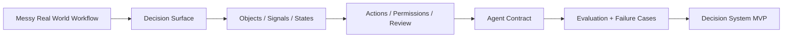

# Palantir Ontology

**Build Palantir-inspired, ontology-driven AI decision systems on your own machine.**

[English](README.md) | [日本語](README.ja.md) | [中文](README.zh-CN.md)

## What this is

`palantir-ontology` is a production-grade Codex/Claude-style skill that helps you turn messy real-world workflows, codebases, datasets, tickets, policies, and operating documents into a **Decision System Spec**:

- what decision the AI system is actually making
- what objects exist in the world
- what signals matter
- what actions are allowed
- where human approval is required
- how to evaluate the system safely
- what the MVP should automate first

This is **not** a proprietary Palantir dump, reverse-engineered internal prompt leak, or official integration.

It is a **Palantir-inspired operating framework** built from public product documentation, public architecture concepts, and practical agent design patterns, packaged into a skill you can use locally inside Codex, Claude Code, or similar agentic developer environments.

## Why this matters

Most "enterprise AI" projects fail for a simple reason:

They start with a model or a prompt instead of a decision.

They build:
- a chatbot
- a retrieval layer
- a long system prompt
- a dashboard

But they do **not** define:
- what the system is deciding
- what state it can observe
- what objects it acts on
- which actions are safe
- where humans must stay in the loop

`palantir-ontology` is designed around a different belief:

> The unit of design is not the prompt.  
> The unit of design is the decision.

That is the core reason this repo exists.

## What you get

Inside this repository:

- a complete reusable skill: [palantir-ontology](palantir-ontology)
- a strong methodology reference for ontology-driven decision design
- action guardrail patterns
- industry packs
- a canonical Decision System Spec template
- a helper script to scaffold specs quickly

This repo is meant for people who want something stronger than "AI chat with files" and lighter than buying a full enterprise platform.

## What the skill actually does

Given either:

- a **goal**  
  Example: `"Triage incidents for release readiness"`

or:

- a **context set**  
  Example: codebase + policy docs + ticket export + CSV + schema

the skill helps you produce:

1. the core business decision
2. the operating objects
3. the critical signals
4. the possible actions
5. the permissions and review boundaries
6. the workflow
7. the evaluation plan
8. the missing data
9. the MVP path

In other words, it turns raw operational mess into a design for a **local AI decision system**.

## The mental model

Think of the framework like this:



Most teams jump straight from A to E.  
This skill forces the middle layers to exist.

## Architecture

The repo mirrors a practical, local version of the useful parts of Palantir's public design logic:

### 1. World model

Model the operational world in terms of:

- objects
- properties
- relations
- states
- signals

### 2. Action model

Define what the system may do:

- `auto`
- `recommend`
- `review`
- `forbidden`

### 3. Agent contract

Specify:

- mission
- visible context
- allowed tools
- response format
- escalation rules
- stop conditions

### 4. Evaluation layer

Stress-test the design against:

- incomplete data
- conflicting evidence
- unsafe actions
- high-cost edge cases
- human bottlenecks

## Repository structure

```text
palantir-ontology/
  SKILL.md
  agents/
    openai.yaml
  references/
    methodology.md
    ontology-patterns.md
    action-guardrails.md
    industry-packs.md
  assets/
    decision-system-spec-template.md
  scripts/
    bootstrap_decision_spec.py
    tests/
      conftest.py
      test_bootstrap_decision_spec.py
```

## Quick start

### 1. Copy the skill into your Codex/Claude-style skills directory

Example layout:

```text
~/.codex/skills/palantir-ontology/
```

### 2. Invoke it with a real goal

Example prompts:

```text
Use $palantir-ontology to turn our incident process into a decision system.
```

```text
Use $palantir-ontology on this ticket export and on-call runbook to design a triage workflow with actions, permissions, and review boundaries.
```

```text
Use $palantir-ontology to inspect this codebase and PRD, then define the ontology and MVP for an AI escalation system.
```

### 3. Generate a starter spec from the CLI

```powershell
& 'C:\Users\sheng\.cache\codex-runtimes\codex-primary-runtime\dependencies\python\python.exe' `
  '.\palantir-ontology\scripts\bootstrap_decision_spec.py' `
  --goal "Prioritize incidents for production release" `
  --context-file "docs\runbook.md" `
  --context-file "data\incidents.csv" `
  --output "reports\decision-system-spec.md"
```

## Who this is for

This repo is especially useful for:

- AI builders who want stronger architecture than prompt hacking
- operators designing AI workflows in real business environments
- founders building vertical AI systems
- internal platform teams
- product and ops teams trying to move from analysis to action
- researchers mapping ontology-based agent design

## Example use cases

- Incident triage
- Release readiness review
- Claims processing
- Customer escalation routing
- Inventory allocation
- Fraud review
- Document approval flows
- Compliance case handling
- Internal ticket prioritization

## What makes this repo different

Most AI repos give you:

- prompts
- agents
- tools
- demos

This repo gives you:

- a **decision design framework**
- a **world-modeling method**
- a **guardrail structure**
- a **governed action model**
- a **portable local skill**

That makes it unusually useful for real-world decision automation.

## Important note

This project is:

- **inspired by** public Palantir concepts
- **not affiliated with** Palantir
- **not an official Palantir project**
- **not a copy of proprietary Palantir internals**

Use it as an open design system for ontology-driven local AI workflows.

## Read more

- [Framework in English](docs/FRAMEWORK.en.md)
- [フレームワーク日本語版](docs/FRAMEWORK.ja.md)
- [框架中文版本](docs/FRAMEWORK.zh-CN.md)

## If this resonates

Star the repo, test it on a real workflow, and publish examples.

The fastest way to make this project stronger is to show:

- the decision you modeled
- the objects you chose
- the actions you allowed
- the review boundaries you kept
- what the MVP automated first

That is how this becomes more than a repo.  
That is how it becomes a shared operating model for real-world AI.
