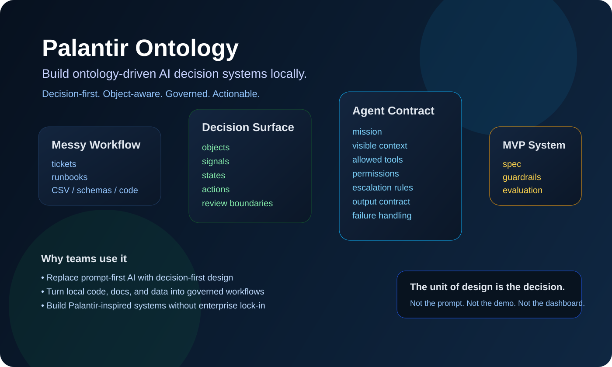

# Palantir Ontology

**把受 Palantir 启发的 ontology-driven AI 决策系统，带到你自己的本地环境里。**

[](LICENSE)


Language: [English](README.md) | [Japanese](README.ja.md) | [Chinese](README.zh-CN.md)



## 这是什么

`palantir-ontology` 是一个高强度、可复用的 Codex / Claude 风格 skill，用来把现实世界中的业务流程、代码库、数据集、工单、政策文档、运营资料，转换成一份 **Decision System Spec**。

它会帮你定义：

- AI 系统到底在做什么决策
- 世界里有哪些关键对象
- 哪些信号最重要
- 哪些动作是允许的
- 哪些地方必须保留人工审批
- 如何安全地评估系统
- MVP 第一阶段最该自动化什么

这不是 Palantir 的内部泄漏，也不是 proprietary prompt 还原，更不是官方集成。

它是一个**基于 Palantir 公开方法论所抽象出来的、本地可运行的设计框架和 skill**。

## 为什么它重要

绝大多数企业 AI 项目失败，原因都差不多：

**它们从模型或 prompt 开始，而不是从 decision 开始。**

很多团队最先做的是：

- chatbot
- retrieval layer
- 很长的 system prompt
- dashboard

但它们没有定义：

- 系统到底在决策什么
- 它能观察什么状态
- 它作用于什么对象
- 哪些动作是安全的
- 哪些地方人必须保留在环

这个 repo 的核心信念很简单：

> 设计单位不是 prompt。  
> 设计单位是 decision。

## 你会得到什么

这个仓库里包含：

- 完整可复用的 skill: [palantir-ontology](palantir-ontology)
- ontology-driven decision design 方法论
- action guardrail 模式
- 行业包
- Decision System Spec 模板
- 快速生成 spec 的辅助脚本

它适合那些想要比“AI+文件聊天”更强、又不想直接买整套企业平台的人。

## 这个 skill 实际会做什么

你只需要给它：

- **goal**  
  例子：`帮我设计一个上线前事故优先级判断系统`

或者：

- **context set**  
  例子：代码库 + 运行手册 + 工单导出 + CSV + schema

它会产出：

1. 核心业务决策
2. 关键业务对象
3. 决策信号
4. 可执行动作
5. 权限与审批边界
6. 决策工作流
7. 评估计划
8. 缺失数据
9. MVP 路线

换句话说，它会把原本混乱的业务现实，变成一个**可在本地实现的 AI 决策系统设计稿**。

## 核心心智模型


大多数团队会直接从 A 跳到 E。  
这个 skill 强制你把中间层补齐。

## 架构思路

这个 repo 复用了 Palantir 公共方法里最值得本地化的部分：

### 1. World model

用以下元素来建模现实世界：

- objects
- properties
- relations
- states
- signals

### 2. Action model

明确 AI 被允许做什么：

- `auto`
- `recommend`
- `review`
- `forbidden`

### 3. Agent contract

定义：

- mission
- visible context
- allowed tools
- response format
- escalation rules
- stop conditions

### 4. Evaluation layer

用这些维度 stress-test 设计：

- 数据缺失
- 信号冲突
- 危险动作
- 高成本边界情况
- 人工审批瓶颈

## 仓库结构

```text
palantir-ontology/
  SKILL.md
  agents/
    openai.yaml
  references/
    methodology.md
    ontology-patterns.md
    action-guardrails.md
    industry-packs.md
  assets/
    decision-system-spec-template.md
  scripts/
    bootstrap_decision_spec.py
    tests/
      conftest.py
      test_bootstrap_decision_spec.py
```

## 快速开始

### 1. 把 skill 放进你的 skills 目录

例如：

```text
~/.codex/skills/palantir-ontology/
```

### 2. 用真实业务问题调用它

```text
Use $palantir-ontology to turn our incident process into a decision system.
```

```text
Use $palantir-ontology on this ticket export and on-call runbook to design a triage workflow with actions, permissions, and review boundaries.
```

```text
Use $palantir-ontology to inspect this codebase and PRD, then define the ontology and MVP for an AI escalation system.
```

### 3. 从 CLI 直接生成 spec 模板

```powershell
& 'C:\Users\sheng\.cache\codex-runtimes\codex-primary-runtime\dependencies\python\python.exe' `
  '.\palantir-ontology\scripts\bootstrap_decision_spec.py' `
  --goal "Prioritize incidents for production release" `
  --context-file "docs\runbook.md" `
  --context-file "data\incidents.csv" `
  --output "reports\decision-system-spec.md"
```

## 适合谁

- 不满足于 prompt hack、希望有更强结构的 AI builder
- 想把 AI 嵌入真实业务流程的 operator
- 做 vertical AI 的 founder
- internal platform team
- 希望从 analysis 走到 action 的 product / ops 团队
- 研究 ontology-based agent design 的人

## 典型用例

- 事故分诊
- 上线前风险审查
- 理赔/审核流转
- 客户升级判断
- 库存分配
- 欺诈审查
- 文档审批流程
- 合规案件处理
- 内部工单优先级排序

## 这个 repo 有什么不一样

大多数 AI repo 给你的是：

- prompts
- agents
- tools
- demos

这个 repo 给你的是：

- **decision design framework**
- **world-modeling method**
- **guardrail structure**
- **governed action model**
- **portable local skill**

所以它更接近真正能落地的业务 AI 设计框架。

## 重要说明

这个项目：

- 受 Palantir 公共概念 **启发**
- **不是 Palantir 官方项目**
- **不隶属于 Palantir**
- **不是对 Palantir 内部资产的复制**

请把它当作一个面向 ontology-driven 本地 AI workflow 的开放设计系统来使用。

## 延伸阅读

- [Framework in English](docs/FRAMEWORK.en.md)
- [フレームワーク日本語版](docs/FRAMEWORK.ja.md)
- [框架中文版本](docs/FRAMEWORK.zh-CN.md)
- [Use cases in English](docs/USE_CASES.en.md)
- [使用案例日文版](docs/USE_CASES.ja.md)
- [使用案例中文版](docs/USE_CASES.zh-CN.md)

## 如果你也认同这个方向

给仓库点个 star，用真实业务跑一次，然后公开你的案例。

让这个项目变强的最快方式，就是分享：

- 你建模了什么 decision
- 你选了哪些 objects
- 你允许了哪些 actions
- 你把 human review 留在哪
- 你在 MVP 第一阶段自动化了什么

这样，它就不只是一个 repo。  
它会逐渐变成 **现实世界 AI 的共通 operating model**。
